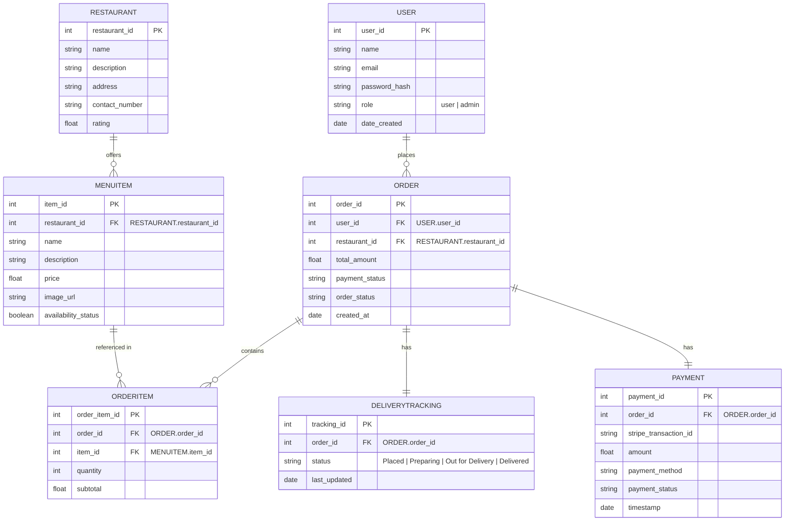

# CP3407 Project - Major Components Explanation

## Overview

FeedMe's architecture was designed with scalability, maintainability, and user experience as core principles. Our design choices reflect modern web development practices while ensuring robust functionality.

## Architectural Design

This architecture shows a simple, cloud-based setup for our FeedMe food app. The frontend (user’s device) communicates securely through Amazon CloudFront, which handles caching and protection before routing requests to the backend. Payments are processed via Stripe, while core application data (orders, users, restaurants) is stored in an Amazon RDS instance, with phpMyAdmin used for database administration.

## Database Design

The ER diagram above defines how data flows through our FeedMe app at a relational level. A user creates an order tied to a specific restaurant, and each order is broken down into multiple order items, which link back to individual menu items (resolving the many-to-many relationship between orders and menu items). Restaurants manage their own menu items, including pricing and availability, while each order stores totals and status information.
Payments are handled in a separate table, allowing each order to have a tracked transaction (e.g., via Stripe), including payment status and method. Delivery tracking is also separated, enabling real-time updates (placed, preparing, out for delivery, delivered) without modifying the main order record. Overall, the design keeps data modular, scalable, and easy to query for key features like order history, live tracking, and restaurant management.

## Interface Design

[Interface Design NinjaMock](https://ninjamock.com/s/558WWZx)

### Home Page

The home page wireframe was designed with a focus on clarity, familarity and ease of navigation, all of which are important qualities for a food delivery storefront.

For all pages, the header places the logo on the left, the site title centrally and the cart and account icons on the right. This follows a widely recognised e-commerce layout convention, meaning users can orient themselves immediately without any learning curve. The cart icon in particular is placed prominently so users always have quick access to their order. The navigation bar includes the Home, Order, Category, The Story/About and Support, covering the core needs of a customer: browsing, ordering, learning about the brand and getting help if necessary. Keeping the navigation bar minimal and horizontal ensures it is uncluttered and easy to scan.

For the home page explicitly, the brief tagline and 'Start Your Order!' call-to-action button are placed high on the page, above the fold. This is to primarily assist first-time visitor should immediately understand what the site does and where to order, 

### Order Page

The order page wireframe is designed to prioritise quick decision making and smooth product selection, which is essential for a food delivery experience. At the top of the page, the standard header layout is maintained.

Below the navigation bar, the page introduces a clear restaurant context line (“Restaurant Name | Estimated Time | Rating”), giving users immediate information about delivery expectations and quality before they begin browsing. This helps reduce uncertainty and supports faster ordering decisions.

The main section consists of repeated dish cards, each structured with an image placeholder on the left, followed by the dish name, short description, and price. This layout mirrors common food delivery platforms, making it intuitive for users. On the right side of each card is a clearly separated “Add to Cart” button, ensuring that the primary action is always visible and easy to complete. This design allows users to compare items quickly.

### Category Page

### The Story Page

### Support Page

