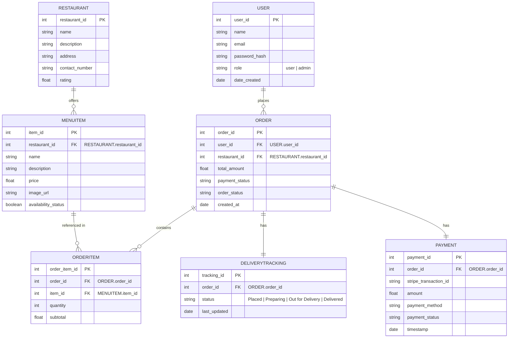

# CP3407 Project - Major Components Explanation

## Overview

FeedMe's architecture was designed with scalability, maintainability, and user experience as core principles. Our design choices reflect modern web development practices while ensuring robust functionality.

## Architectural Design

## Database Design

## Interface Design

[Interface Design NinjaMock](https://ninjamock.com/s/558WWZx)
