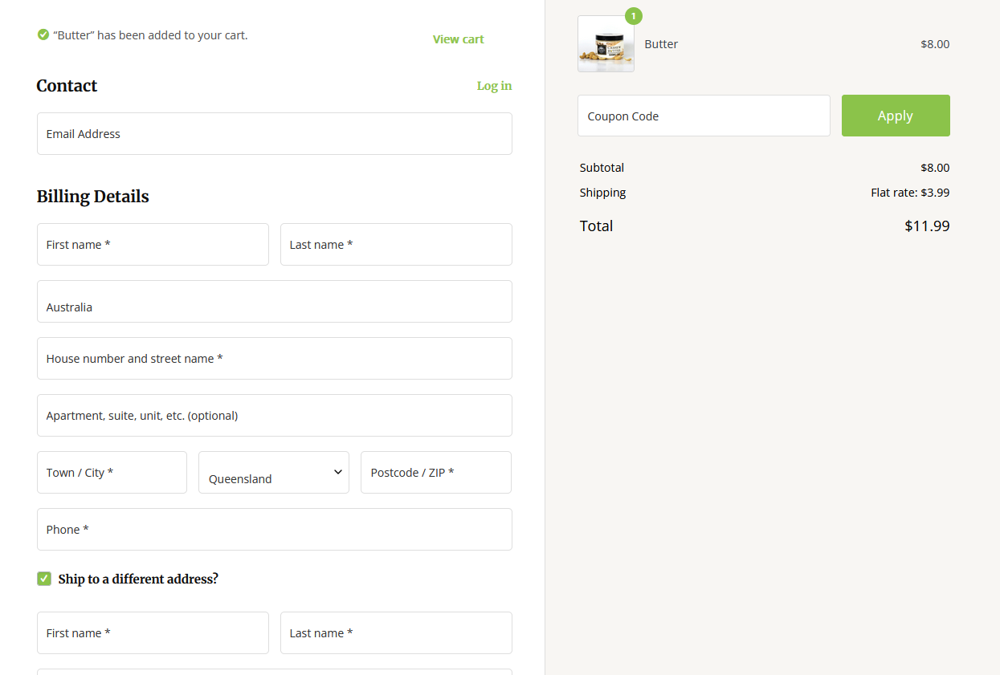

Create more md files like this one as needed. Place them into the same folder 
as this [user_stories folder](./)

# User story title: Let users checkout their order

Once selecting their order users can go to checkout and pay for their order.

## Priority: High 
Checkout is essential for the app to run, so the priority is set to high.

## Estimation: 8 Days
Any notes on estimation go here. Keep your planning poker game numbers. For example
* Dean: 6 days
* Nick: 7 days
* Gurjas: 9 days
* Nikodem: 8
* Dylan: 7

## Assumptions (if any):
- Extensive testing will be required to avoid problems with payments
- Time may be slowed down due to credit company policies or similar

## Description: e.g. The web page will show current deals to Orion's orbits users
You need to keep all versions here so that your instructor/marker can see your changes easily. 
In a real project, your older versions could be viewed via commits.

Description-v1: The web page will allow users to pay for their order and receive order details.

## Tasks, see chapter 4.

1. Create separate check out page, Estimation 1 days
2. Implement payment options eg. mastercard, paypal..., Estimation 3 days
3. Create a confirm page that will give order id + extra information about order (time), Estimation 1 day
4. Test to make sure no errors with payments. Estimation 2-3 days
   

# UI Design:

# Completed:

