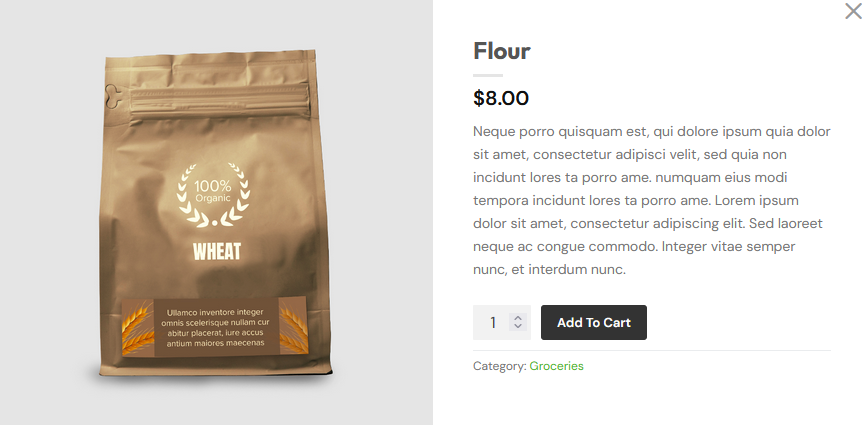

* User can add food to the cart

# Priority: High
* This is a core feature. Users must add food before ordering. Planned for the first iteration.

# Estimation: 2 days
* Nick: 2 days
* Dean: 2 days
* Gurjas: 3 days
* Nikodem: 2 days
* Dylan: 3 days

# Assumptions (if any):
* Food items are already stored in the database.
* Each item has price and description.
* User is logged in.

# Description:
* The application will allow users to add selected food items to their cart before checkout.

# Tasks
* Design “Add to Cart” button in UI, Estimation 0.5 days
* Create cart table in database, Estimation 0.5 days
* Implement backend logic to store cart items, Estimation 0.5 days
* Display cart page with selected items, Estimation 0.5 days

# UI Design:

# Completed:
* Insert screenshots after implementation.
* Show iteration improvements if any.

