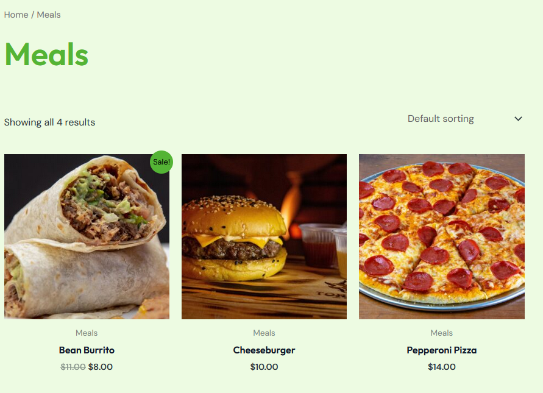

# Add functional category link

Allow users to click category links to filter food items.

Keep any other version here as well, e.g. Category filtering, Clickable food categories.

## Priority: High 
This is essential for usability and helps users quickly find items.

## Estimation: 2 days
Planning poker estimates:
* Nick: 2 days
* Dean: 2 days
* Gurjas: 2 days
* Nikodem: 2 days
* Dylan: 2 days

## Assumptions (if any):
- Food items are categorised (e.g. pizza, drinks, desserts).
- Categories are stored in database.
- UI already displays category links or buttons.
- Navigation bar is present on all pages.

## Description:

Description-v1:  
The website will allow users to click on food categories to filter and display only relevant items from the menu.

Description-v2:  
During testing, it was identified that the main "Shop By Category" link in the navigation bar was non-functional. This prevented users from accessing category-based filtering and required implementation/fixing in iteration 2 to restore expected navigation behaviour.

## Tasks:

1. Investigate why "Shop By Category" link is not functioning, Estimation 0.5 days
2. Link navigation item to correct category page or section, Estimation 0.5 days
3. Implement category filtering logic if missing, Estimation 0.5 days
4. Ensure categories correctly retrieve data from database, Estimation 0.5 days
5. Test navigation and filtering across all categories, Estimation 0.5 days

# UI Design:
* Navigation bar includes "Shop By Category" link.
* Clicking the link redirects to category page or scrolls to category section.
* Categories displayed as buttons or sections (e.g. Pizza, Burgers, Drinks).
* Active category clearly highlighted.

# Completed:
* Screenshots showing working "Shop By Category" link.
* Screenshots of category filtering in action.
* Before and after comparison (non-functional vs fixed).

